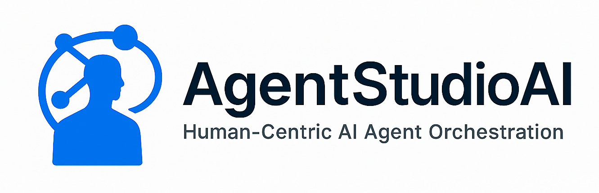

# AgentStudio.AI Core



## Human-Centric AI Agent Orchestration Framework

[](https://github.com/agentstudio-ai)
[](LICENSE)
[](https://github.com/agentstudio-ai)

## Overview

AgentStudio.AI Core is the foundational framework for building human-centric AI
agent orchestration systems. It provides cognitive templates, workflow patterns,
and agent definitions that enable developers to create AI agents that work
collaboratively with humans rather than replacing them.

## Key Features

- **Cognitive Templates**: 19 thinking patterns for different agent behaviors
- **Domain Templates**: 12 domain-specific agent templates for common roles
- **Workflow Orchestration**: Pre-defined patterns for multi-agent collaboration
- **Shared-Knowledge System**: Tool-specific knowledge files to prevent agent
  context drift
- **Human-Centric Design**: Built-in human checkpoints and collaboration patterns
- **Template-Based**: YAML-based configuration for easy customization
- **Platform Agnostic**: Works across different AI platforms and frameworks

## Quick Start

### Installation

This package is designed as a supporting framework for other
AgentStudio.AI packages and tools. It provides the foundational
templates and shared-knowledge files that other packages depend on.

**For end users**: Install the [AgentStudio.AI CLI](https://github.com/agentstudio-ai)
or other AgentStudio.AI packages, which will automatically include this core
framework.

**For developers**: This package is typically installed as a dependency when
building AgentStudio.AI extensions or custom agent implementations.

## Project Structure

```text
AgentStudio.AI.Core/
├── .github/                      # GitHub workflows and configuration
│   └── workflows/ci-cd.yml       # CI/CD pipeline
├── images/                       # Logo and assets
├── scripts/                      # Build and utility scripts
│   ├── build.ps1/.sh             # Package building scripts
│   ├── cleanup.ps1/.sh           # Build artifact cleanup
│   ├── full-build-test.ps1/.sh   # Complete build and test pipeline
│   └── validate.ps1/.sh          # Package validation scripts
├── src/                          # Source files and package configuration
│   ├── agents/                   # Agent templates and patterns
│   │   ├── cognitive/            # 19 cognitive thinking patterns
│   │   └── domain/               # 12 domain-specific agent templates
│   ├── templates/                # Workflow and communication templates
│   │   ├── agent-messages/       # Agent communication templates
│   │   └── workflows/            # Workflow orchestration patterns
│   ├── shared-knowledge/         # Tool-specific knowledge files
│   │   ├── github-cli.yml        # GitHub CLI usage knowledge
│   │   └── docker-cli.yml        # Docker CLI usage knowledge
│   └── AgentStudio.AI.Core.csproj # NuGet package configuration
├── CHANGELOG.md                  # Change history
├── CONTRIBUTING.md               # Contribution guidelines
├── LICENSE                       # MIT license
├── README.md                     # This file
└── VERSION                       # Version tracking
```

## Agent Templates

### Cognitive Templates

The framework includes 19 cognitive thinking patterns:

- **Analytical Thinking** - Systematic problem decomposition
- **Creative Problem Solving** - Innovative solution generation
- **Design Thinking** - Human-centered problem solving
- **Systems Thinking** - Holistic, interconnected analysis
- **Agile Thinking** - Iterative, collaborative development
- **And 14 more...**

### Domain Templates

The framework includes 12 domain-specific agent templates for common roles:

- **Backend Software Engineer** - Server-side development and architecture
- **Frontend Software Engineer** - User interface and client-side development
- **DevOps Engineer** - Infrastructure, deployment, and automation
- **Data Science Engineer** - Data analysis, ML, and statistical modeling
- **Product Owner** - Product management and stakeholder coordination
- **Security Engineer** - Security architecture and vulnerability management
- **And 6 more specialized roles...**

## Workflow Patterns

Pre-defined workflow patterns for common scenarios:

- **Linear Workflows** - Sequential task execution
- **Iterative Workflows** - Loop-based collaboration
- **Human Checkpoint Workflows** - Human approval gates
- **Hybrid Workflows** - Complex multi-pattern
  orchestration

## Shared-Knowledge System

The framework includes a revolutionary shared-knowledge system designed to
prevent AI agent context drift and reduce trial-and-error behavior:

### Purpose

- **Tool-Specific Knowledge**: Comprehensive usage guides for common
  development tools
- **Context Preservation**: Prevents agents from forgetting tool usage over time
- **Reduced Errors**: Eliminates trial-and-error approaches to tool usage
- **Consistent Behavior**: Ensures agents follow best practices consistently

### Current Knowledge Files

- **GitHub CLI**: Complete usage guide with interactive command warnings and
  best practices
- **Docker CLI**: Comprehensive Docker command reference with container lifecycle management
- **More coming soon**: Kubernetes, Git, and other development tools

### Format

Knowledge files use a hybrid YAML + Markdown format:

- **YAML metadata**: Quick reference and structured information
- **Markdown content**: Detailed usage guides and examples
- **Interactive warnings**: Special handling for commands requiring user input

## Development Status

**Current Version**: 0.4.0-beta

This is an early beta release. The framework is under active development and the
API may change between versions.

### Roadmap

- [x] Complete cognitive template library (19 templates)
- [x] Basic domain-specific templates (12 core domain templates)
- [x] Base workflow pattern templates
- [ ] Template validation and testing framework
- [ ] Documentation and examples for all templates
- [x] Templates for agent-messages, shared-knowledge, and events
- [ ] Refinement and inclusion of JARVIS (AI/Prompt Expert)
- [x] Docker shared-knowledge file
- [ ] Additional shared-knowledge files (Kubernetes, Git, etc.)
- [ ] Enhanced CI/CD pipeline with automated testing

## Contributing

We welcome contributions! Please see our [Contributing Guidelines](CONTRIBUTING.md)
for details.

### Development Setup

1. **Clone the repository**

   ```bash
   git clone https://github.com/agentstudio-ai/AgentStudio.AI.Core.git
   cd AgentStudio.AI.Core
   ```

2. **Review the framework files** in `src/` directory:

   - `agents/` - Cognitive and domain-specific agent templates
   - `templates/` - Workflow and communication templates
   - `shared-knowledge/` - Tool-specific knowledge files
   - `AgentStudio.AI.Core.csproj` - NuGet package configuration

3. **Available Scripts** (both PowerShell and Bash versions):

   - **`build.ps1/.sh`** - Builds NuGet package from source files
   - **`validate.ps1/.sh`** - Validates package structure and content
   - **`cleanup.ps1/.sh`** - Removes build artifacts and temporary files
   - **`full-build-test.ps1/.sh`** - Complete pipeline: cleanup → build → validate

4. **Test your changes**:

   ```bash
   # Quick build test
   ./scripts/build.ps1    # Windows PowerShell
   ./scripts/build.sh     # Linux/macOS Bash

   # Full pipeline test
   ./scripts/full-build-test.ps1    # Windows PowerShell
   ./scripts/full-build-test.sh     # Linux/macOS Bash
   ```

5. **Submit a pull request** following our [Contributing Guidelines](CONTRIBUTING.md)

## Changelog

See [CHANGELOG.md](CHANGELOG.md) for a detailed list of changes, new features,
and bug fixes in each version.

## License

This project is licensed under the MIT License - see the [LICENSE](LICENSE) file
for details.

## Related Projects

- [AgentStudio.AI.CLI](https://github.com/agentstudio-ai) - Command-line interface
- [AgentStudio.AI.Agents](https://github.com/agentstudio-ai) - Pre-built agent templates
- [AgentStudio.AI.Workflows](https://github.com/agentstudio-ai) - Workflow patterns

## Development

### Recommended VS Code Extensions

For contributors working with this codebase, we recommend installing these VS Code
extensions:

- **XML** (Red Hat) - For `.csproj` file validation and IntelliSense
- **YAML** (Red Hat) - For template and shared-knowledge file validation and formatting
- **Prettier** - For consistent code formatting across all file types
- **markdownlint** - For README, documentation, and agent-generated markdown
  file validation

These extensions ensure consistent formatting and catch syntax errors early in the
development process. The markdownlint extension is particularly important as many
agent-generated files and documentation use Markdown format.

## Support

- 📖 [Documentation](docs/)
- 🐛 [Issue Tracker](https://github.com/agentstudio-ai/AgentStudio.AI.Core/issues)
- 💬 [Discussions](https://github.com/agentstudio-ai/AgentStudio.AI.Core/discussions)

---

## Built with ❤️ by the AgentStudio.AI team
